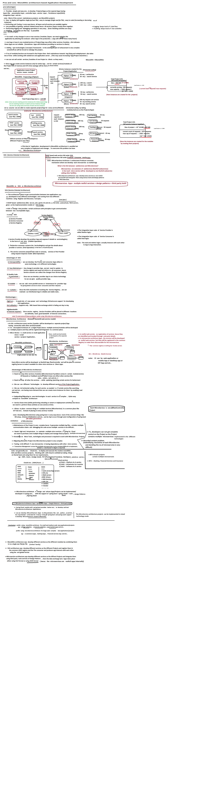
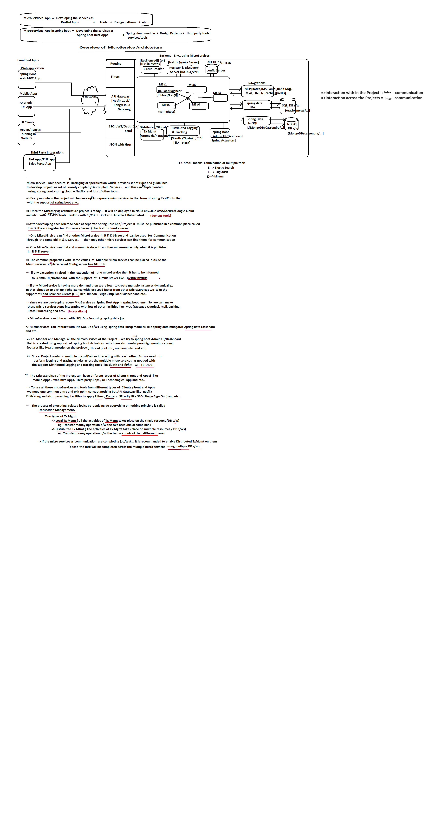
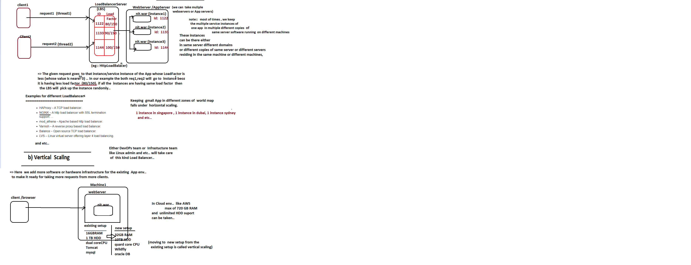

# Spring Cloud  *(Working with Microservices)* 

In Spring Boot, the Microservice architecture is implemented with the support of Spring Cloud Module and multiple other facilities.  


- **Why prefer Spring Boot over Spring Framework?**  
  - We prefer Spring Boot to implement Microservices as it simplifies configuration and offers Spring Cloud support. 
  
## Need of Microservices  

### Monolithic Apps vs SOA Apps vs Microservices Applications
### Monolithic Applications  

- **Definition**  
  The application packages multiple services as modules in a single unit (project) and is deployed as `.war`, `.jar`, or `.ear` files.  

- **Key Features**  
  - One application = One project containing multiple services as modules.  
  - Examples: `Admissions`, `Batches`, `Accounts`, `Payroll` services combined into one `.war`/`.jar`/`.ear`.  

- **Examples**  
  - NareshIT.com  
  - Flipkart.com  
  - Banking Applications  

  

#### Build Process  

- **Artifacts**  
  - `.war` → Web application archive.  
  - `.jar` → Standalone or embedded web application.  
  - `.ear` → Enterprise archive (combines `.jar` and `.war` files).  

- **Process**  
  1. Compile source code.  
  2. Add dependencies, properties files, and libraries.  
  3. Create `.war` or `.jar` representing the project.  

- **Tools Used**  
  - Maven or Gradle for building projects.  
  - Jenkins for CI/CD pipeline automation.  

### What are API, App, and Service?  

- **API**  
  Application Programming Interface provides classes, interfaces, and annotations to build applications.  
  - **Types**: Predefined, User-defined, Third-party APIs.  

- **Application/Service**  
  Outcome of the build process as a `.jar` or `.war` file performing specific tasks.  

- **Examples**  
  - JDBC API: Used to develop persistence logic.  
  - Spring Data JPA API: Built using Hibernate API.  

---

## Deployment/Installation  

- **Deployment Types**  
  - **Hot Deployment**: App deployed while the server is running.  
  - **Cold Deployment**: App deployed when the server is stopped.  

- **Environment Setup**  
  - Development/Test: Local servers or company cloud accounts (AWS, GCP, Azure).  
  - UAT/Production: Client organization’s servers or cloud accounts.  

- **Deployment Tools**  
  - Docker: Packs code and environment together for portability.  

---

## Service Instance  

- **Definition**  
  A running application inside a server rendering services to clients.  

- **Examples**  
  - `App/Project` → Like a class.  
  - `Instance` → Like an object (running copy of the application).  

- **Properties**  
  - Configurable max requests using `application.properties`.
  - This properties is related to embedded servers of spring boot
    ```properties
    server.tomcat.threads.max=150
    server.jetty.threads.max=300
    ```

- Example configuration for Tomcat:
- This properties is related to external servers of spring boot

```xml
<Executor name="tomcatThreadPool" namePrefix="catalina-exec-" maxThreads="150" minSpareThreads="4"/>
```

## Load and Scaling  

- **Load Count**  
  Number of requests currently being processed by a service instance.  

- **Load Factor**  
  Ratio of current load to max load:  
```text
  Load Factor = Current Load / Max Load
```
# Load Count/Current Load
===========================
- The number of requests that are currently being processed by a service instance is called Load Count/Current Load.
- For example, if the App1 instance/service instance is currently processing 10 requests, then the Load Count/Current Load is 10.

# Load Factor
==============
- Load Factor = Current Load / Max Load
- For instance, if the app instance's maximum load capacity with respect to the server is 150, and the app instance is currently processing only 100 requests, the Load Factor is calculated as:  
  `100 / 150 = 0.666`
- The Load Factor is always between 0 and 1 (inclusive), i.e., `0 <= Load Factor <= 1`.

- **maxLoad**: The maximum number of requests the server can handle for each instance of the application at a time. This can be specified through server settings or via `application.properties` when working with embedded servers in Spring Boot.

# Scaling
==========
- In an external Tomcat server, increasing the service capacity of an app/service/project is referred to as Scaling.
- An app is considered scalable if it has the ability to increase its service capacity as needed.

### Examples:
1. **Vertical Scaling**:  
   - Increasing the capacity of a shop from 1000 square feet to 10000 square feet.
2. **Horizontal Scaling**:  
   - Keeping the same size shop of 1000 square feet in 10 different locations.
3. **Horizontal Scaling (ATM example)**:  
   - Increasing the number of ATM machines across different locations.
4. **Vertical Scaling (ATM example)**:  
   - Increasing the number of ATM machines in a single location/room.

# Two Types of Scaling

## a) Horizontal Scaling (Good)
## b) Vertical Scaling (Not Recommended)

### a) Horizontal Scaling
In horizontal scaling, we take multiple copies of the same app, i.e., multiple service instances, to provide services to clients. These instances are controlled with the support of a Load Balancer Service (LBS).


# Pros and Cons of Monolithic Architecture Based Application Development

## Pros (Advantages)

### In Cloud Environment (e.g., AWS)
- Maximum of **720 GB RAM** and **unlimited HDD support** can be utilized.
- Moving to a new setup from the existing setup is called **vertical scaling**.

### Other Advantages:
- **Simplified development**: Provides a simple and easy environment to develop projects/apps with layered architectures like:
  - Presentation layer
  - Controller layer
  - Service layer
  - Persistence layer (DAO)
  - Integration layer
  - etc.
  
  *Note*: Most of the current maintenance projects are **monolithic** projects.

- **Easy to deploy**: Everything is packaged together in a single **jar/war file**.
- **Easy to manage**: Since there’s only one war/jar file, it’s simpler to handle.
- **Easy to scale**: Scaling involves simply increasing or decreasing instances.
- **Unit testing**: Performing unit testing is easier because all layers and services are available together.
- **Reduced network-related issues**: Since all services and layers are typically within the same environment, the likelihood of encountering network-related issues is minimized.
- **Logging and debugging**: Easy to perform logging and debugging, including auditing activities.

---

## Cons (Disadvantages)

- **Redeployment requirement**: For small or minor changes in one or two services/modules/layers, the entire application needs to be redeployed. This may require informing end-users when the app is in production, and the app may be unavailable for a few hours.
- **Reliability issues**: A bug or issue in one module/service can potentially affect other modules, which means the app is less reliable. In some cases, this could lead to the app shutting down and providing no services to clients.
