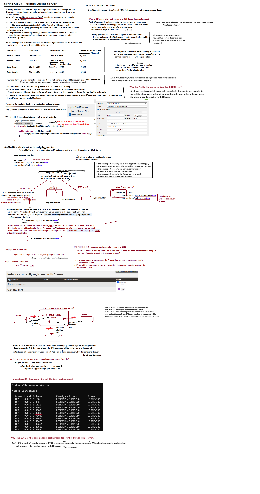
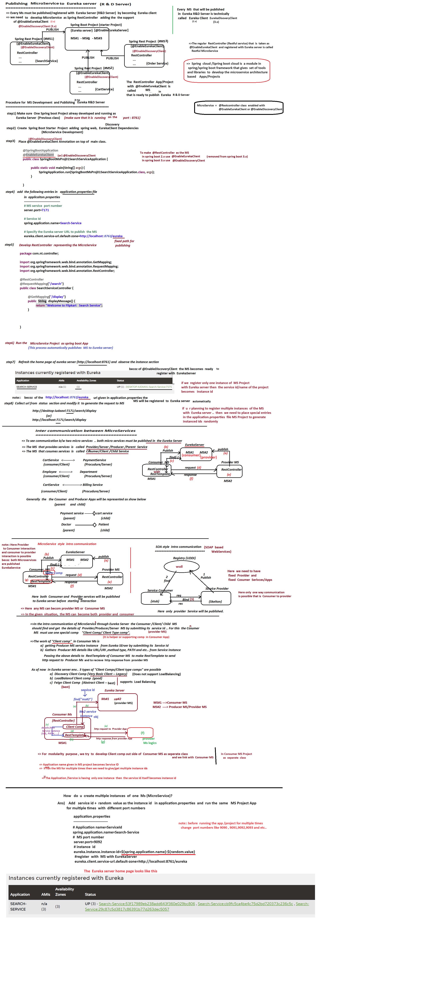

## How to create multiple instances of one microservice?

- Add service id + random value as instance id in `application.properties` and run the same microservice project with different port numbers.

```properties
 eureka.instance.instance-id=${spring.application.name}:${random.value}
```

## Inter Communication between Microservices

- To see communication between two microservices, both microservices must be published in the Eureka Server.
- The Consumer/Client/Child microservice should find and get the details of the provider/producer/server microservice by submitting its service ID. For this, the consumer microservice must use one special component called "Client Component" or "Client Type Component."

### The work of "Client Component" in the consumer microservice:

- Getting the producer microservice service instance from Eureka server by submitting its service ID.
- Gathers producer microservice details like URL/URI, method type, path, etc., from the service instance.
- Passes the above details to `RestTemplate` of the consumer microservice to make the HTTP request to the producer microservice and receive the HTTP response.

### As of now, in the Eureka server environment, 3 types of "Client Component/Client Type" are possible:

1. **Discovery Client Component** (Very Basic Client - Legacy)
   - Does not support Load Balancing.
   
2. **Load Balancing Client Component** (Good)
   - Supports load balancing.
   
3. **Feign Client Component** (Abstract Client - Best)
   - Supports load balancing.


