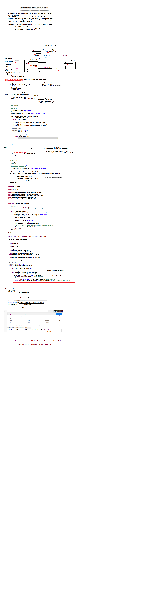

In **Spring Boot**, a **Discovery Client** is a component that enables your application to interact with a service registry (such as **Eureka**, **Consul**, or **Zookeeper**) to find and communicate with other services in a distributed system. It is a key part of **Service Discovery**, which is an essential pattern in microservices architectures where services need to discover each other dynamically without needing to manually configure URLs or IP addresses.

Spring Boot provides support for service discovery using **Spring Cloud** projects, most notably **Spring Cloud Netflix Eureka**. With Spring Cloud, a Discovery Client in a Spring Boot application can automatically register the service with the registry and look up other services when needed.

### How Discovery Client Works in Spring Boot

1. **Service Registration:**
   - When a Spring Boot application starts, it registers itself with the service registry (Eureka, Consul, etc.). This typically involves sending information like the service name, instance ID, and metadata to the registry.
   
2. **Service Discovery:**
   - Once a service is registered in the registry, other services can query the registry using the Discovery Client to discover instances of the service they need to communicate with. The client queries the registry and retrieves information like available instances, their addresses, and health status.

3. **Dynamic Communication:**
   - When a service needs to communicate with another service, it does not rely on hardcoded IPs or URLs. Instead, it uses the Discovery Client to query the registry to get the location of the service instances, ensuring that communication is dynamic and adaptive to changes.

### Example of Discovery Client in Spring Boot

To set up service discovery in a Spring Boot application using **Eureka** as the service registry, you need to add Spring Cloud dependencies to your project and configure the application accordingly.

You're absolutely correct! The `@EnableEurekaClient` annotation is now considered outdated in Spring Cloud. Instead, the `@EnableDiscoveryClient` annotation is the preferred way to enable service discovery, and it works with multiple service discovery platforms, including **Eureka**, **Consul**, **Zookeeper**, and others.

Here's how to update the Spring Boot application to use `@EnableDiscoveryClient` instead of `@EnableEurekaClient`:

### Updated Example with `@EnableDiscoveryClient`

#### 1. **Add Dependencies**

First, make sure to include the necessary dependencies. Here's the updated `pom.xml` for Maven:

```xml
<dependencies>
    <dependency>
        <groupId>org.springframework.cloud</groupId>
        <artifactId>spring-cloud-starter-netflix-eureka-client</artifactId>
    </dependency>
    <dependency>
        <groupId>org.springframework.boot</groupId>
        <artifactId>spring-boot-starter-web</artifactId>
    </dependency>
</dependencies>
```

For **Gradle**:

```groovy
dependencies {
    implementation 'org.springframework.cloud:spring-cloud-starter-netflix-eureka-client'
    implementation 'org.springframework.boot:spring-boot-starter-web'
}
```

#### 2. **Enable Discovery Client in Spring Boot**

Replace `@EnableEurekaClient` with `@EnableDiscoveryClient` in your Spring Boot application main class:

```java
import org.springframework.boot.SpringApplication;
import org.springframework.boot.autoconfigure.SpringBootApplication;
import org.springframework.cloud.client.discovery.EnableDiscoveryClient;

@SpringBootApplication
@EnableDiscoveryClient // This enables service discovery for multiple platforms, including Eureka
public class DiscoveryClientApplication {
    public static void main(String[] args) {
        SpringApplication.run(DiscoveryClientApplication.class, args);
    }
}
```

By using `@EnableDiscoveryClient`, your application can now register with Eureka, Consul, or other service registries that are supported by Spring Cloud.

#### 3. **Configure `application.properties`**

Make sure you have the proper configuration for Eureka in your `application.properties` (or `application.yml`):

```properties
spring.application.name=my-service
eureka.client.service-url.defaultZone=http://localhost:8761/eureka/
```

This will register your service with a local Eureka server running at `http://localhost:8761/eureka/`.

#### 4. **Accessing Discovery Client**

You can still use the `DiscoveryClient` interface to query and discover other services:

```java
import org.springframework.beans.factory.annotation.Autowired;
import org.springframework.cloud.client.discovery.DiscoveryClient;
import org.springframework.web.bind.annotation.GetMapping;
import org.springframework.web.bind.annotation.RestController;

@RestController
public class DiscoveryClientController {

    @Autowired
    private DiscoveryClient discoveryClient;

    @GetMapping("/services")
    public String getServices() {
        return "Services registered with Eureka: " + discoveryClient.getServices();
    }
}
```

In this example, the `/services` endpoint will return the list of services registered with Eureka.

### Why Use `@EnableDiscoveryClient`?

- **Compatibility with Multiple Registries:** The `@EnableDiscoveryClient` annotation is a more general-purpose annotation that works with any service discovery solution supported by Spring Cloud (not just Eureka, but also Consul, Zookeeper, etc.).
- **Future-Proof:** Spring Cloud has moved towards supporting multiple service discovery platforms. `@EnableDiscoveryClient` is the preferred approach, ensuring that your service discovery setup is flexible and future-proof.
- **Simple and Clean:** It's a more streamlined approach to service discovery that aligns with Spring Cloud's broader service discovery strategy.

In this example, the `DiscoveryClientController` exposes an endpoint that returns a list of all the services registered with Eureka. The `discoveryClient.getServices()` method retrieves the list of services that are currently available in the registry.

### Advantages of Discovery Client in Spring Boot

1. **Dynamic Service Discovery:** The Discovery Client allows your application to find services dynamically without needing to manually configure the service locations, providing flexibility and scalability.
   
2. **Fault Tolerance and Load Balancing:** When the client queries the service registry, it can retrieve multiple instances of a service and automatically balance the load by selecting one of the available instances. You can also handle failures by automatically switching to healthy instances.

3. **Service Health Monitoring:** Many service registries (like Eureka) provide health monitoring, so the Discovery Client can query the registry for the health status of services and avoid calling unhealthy instances.

4. **Integration with Spring Cloud:** The Spring Cloud ecosystem integrates well with Discovery Clients, offering additional features like **configurations**, **security**, and **circuit breakers**. Spring Cloud also supports integration with other service registries like **Consul** and **Zookeeper**.