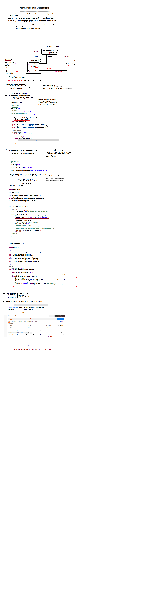

### What is **Discovery Client** in Spring Boot?

In Spring Boot, **Discovery Client** is an interface provided by Spring Cloud that is used to interact with service discovery systems. It allows Spring Boot applications to register with a service registry and discover other services within a system. The `DiscoveryClient` interface abstracts the details of the underlying service discovery mechanism, whether it's Eureka, Consul, Zookeeper, or any other service discovery platform.

When you integrate Spring Cloud with a service discovery platform like Eureka, Consul, or Zookeeper, your Spring Boot application can automatically register itself as a service with the discovery system and discover other services dynamically. The `DiscoveryClient` interface provides methods for querying and interacting with registered services.

**Key methods of `DiscoveryClient`:**
- `getServices()`: Returns a list of all registered services.
- `getInstances(String serviceId)`: Returns the list of instances (i.e., microservices) for a given service ID.
- `getService(String serviceId)`: Returns the service with the given ID, typically for more specific information.

Here’s an example of using the `DiscoveryClient` in Spring Boot:
```java
import org.springframework.beans.factory.annotation.Autowired;
import org.springframework.cloud.client.discovery.DiscoveryClient;
import org.springframework.web.bind.annotation.GetMapping;
import org.springframework.web.bind.annotation.RestController;

@RestController
public class DiscoveryController {

    @Autowired
    private DiscoveryClient discoveryClient;

    @GetMapping("/services")
    public String getServices() {
        return String.join(", ", discoveryClient.getServices());
    }
}
```

This would return a list of services that have registered with the service registry (e.g., Eureka, Consul, etc.).

### Differences Between **Eureka**, **Consul**, and **Zookeeper** for Service Discovery

These are all service discovery tools that allow services in a microservices architecture to discover and communicate with each other dynamically. However, they have different architectures, use cases, and features:

---

### 1. **Eureka (from Netflix)**
   - **Overview**: Eureka is a REST-based service registry and discovery server developed by Netflix. It is primarily used for service registration and discovery in microservices applications.
   - **Key Features**:
     - **Client-side load balancing**: Eureka allows clients to interact directly with instances of services without needing a load balancer.
     - **Self-registration**: Services register themselves with Eureka, and Eureka maintains a list of available services.
     - **Fault tolerance**: Services can continue to operate even if they lose contact with Eureka for a brief period (due to client-side resilience patterns like retry and fallback).
     - **Health Checks**: Eureka performs periodic health checks to determine if services are healthy and should be removed from the registry if they fail.
   - **Use Cases**: Ideal for microservices architectures using client-side load balancing (e.g., Ribbon) and fault tolerance.

   - **Spring Boot Integration**:
     - Eureka integration is provided through `spring-cloud-starter-netflix-eureka-client`.

---

### 2. **Consul (from HashiCorp)**
   - **Overview**: Consul is a distributed tool that provides service discovery, health checking, and key-value storage. It was built with distributed systems in mind and supports service discovery in cloud-native applications.
   - **Key Features**:
     - **Service Registration & Discovery**: Services register themselves with Consul and discover other services.
     - **Health Checks**: Consul has powerful health check capabilities and will only return healthy services.
     - **Multi-datacenter Support**: Consul supports multiple datacenters, which is useful for geographically distributed services.
     - **Key-Value Store**: It offers a KV store to hold configuration data, making it ideal for configuration management alongside service discovery.
     - **DNS and HTTP Interface**: It provides both DNS-based and HTTP API-based methods for service discovery.
   - **Use Cases**: Suitable for both small and large-scale environments, especially when you need health checks and key-value configuration management.

   - **Spring Boot Integration**:
     - Consul integration is provided through `spring-cloud-starter-consul-discovery`.

---

### 3. **Zookeeper (Apache ZooKeeper)**
   - **Overview**: Zookeeper is a distributed coordination service that was designed for maintaining configuration information, naming, and providing synchronization services for distributed systems. It is widely used for high-availability and consistency in distributed systems.
   - **Key Features**:
     - **Service Discovery**: Zookeeper can be used for service discovery by registering services in the form of Zookeeper nodes and letting clients discover them.
     - **Distributed Coordination**: It can manage configuration, synchronization, and coordination tasks such as leader election and locks.
     - **Fault Tolerance & High Availability**: Zookeeper is designed to be highly available and consistent.
     - **Data Model**: Zookeeper uses a hierarchical tree structure (similar to a filesystem) to store nodes, which can be used for service registration.
   - **Use Cases**: Best used in systems where you need distributed coordination (e.g., leader election) and service discovery, especially in large-scale systems requiring high availability and consistency.

   - **Spring Boot Integration**:
     - Zookeeper integration is provided through `spring-cloud-starter-zookeeper-discovery`.

---

### **Key Differences Between Eureka, Consul, and Zookeeper**:

| Feature                          | **Eureka**                                | **Consul**                                | **Zookeeper**                              |
|-----------------------------------|-------------------------------------------|-------------------------------------------|-------------------------------------------|
| **Service Discovery**             | Yes, with client-side load balancing.     | Yes, with support for both DNS and HTTP.  | Yes, through nodes in the Zookeeper tree.  |
| **Health Checks**                 | Yes, built-in health checks.              | Yes, robust health checks for services.   | Limited, you would need to manage it manually. |
| **Key-Value Store**               | No                                        | Yes, used for storing configuration.      | Yes, Zookeeper is a key-value store.      |
| **Fault Tolerance**               | Built-in, with client-side resiliency.    | High availability with automatic failover. | High availability and leader election.    |
| **Multi-Datacenter Support**      | Limited (single datacenter typically).    | Yes, supports multiple datacenters.       | Yes, works across multiple datacenters.   |
| **Use Cases**                     | Microservices with client-side load balancing (Netflix stack). | Microservices, service discovery, and configuration management in cloud-native apps. | Coordination, service discovery, leader election in distributed systems. |
| **Spring Cloud Integration**      | `spring-cloud-starter-netflix-eureka-client` | `spring-cloud-starter-consul-discovery`    | `spring-cloud-starter-zookeeper-discovery` |
| **Data Model**                    | No structured data model (just service registration). | Hierarchical with key-value store.        | Hierarchical tree-like data model (similar to filesystem). |

---

### Summary:

- **Eureka**: Best for Netflix-style service discovery with client-side load balancing, primarily used for microservices architectures.
- **Consul**: More feature-rich with support for multi-datacenter, health checks, key-value storage, and more, making it suitable for large-scale, cloud-native applications.
- **Zookeeper**: Best for distributed coordination and synchronization tasks, along with service discovery, especially in highly consistent and fault-tolerant systems.


In **Spring Boot**, a **Discovery Client** is a component that enables your application to interact with a service registry (such as **Eureka**, **Consul**, or **Zookeeper**) to find and communicate with other services in a distributed system. It is a key part of **Service Discovery**, which is an essential pattern in microservices architectures where services need to discover each other dynamically without needing to manually configure URLs or IP addresses.

Spring Boot provides support for service discovery using **Spring Cloud** projects, most notably **Spring Cloud Netflix Eureka**. With Spring Cloud, a Discovery Client in a Spring Boot application can automatically register the service with the registry and look up other services when needed.

### How Discovery Client Works in Spring Boot

1. **Service Registration:**
   - When a Spring Boot application starts, it registers itself with the service registry (Eureka, Consul, etc.). This typically involves sending information like the service name, instance ID, and metadata to the registry.
   
2. **Service Discovery:**
   - Once a service is registered in the registry, other services can query the registry using the Discovery Client to discover instances of the service they need to communicate with. The client queries the registry and retrieves information like available instances, their addresses, and health status.

3. **Dynamic Communication:**
   - When a service needs to communicate with another service, it does not rely on hardcoded IPs or URLs. Instead, it uses the Discovery Client to query the registry to get the location of the service instances, ensuring that communication is dynamic and adaptive to changes.

### Example of Discovery Client in Spring Boot

To set up service discovery in a Spring Boot application using **Eureka** as the service registry, you need to add Spring Cloud dependencies to your project and configure the application accordingly.

You're absolutely correct! The `@EnableEurekaClient` annotation is now considered outdated in Spring Cloud. Instead, the `@EnableDiscoveryClient` annotation is the preferred way to enable service discovery, and it works with multiple service discovery platforms, including **Eureka**, **Consul**, **Zookeeper**, and others.

Here's how to update the Spring Boot application to use `@EnableDiscoveryClient` instead of `@EnableEurekaClient`:

### Updated Example with `@EnableDiscoveryClient`

#### 1. **Add Dependencies**

First, make sure to include the necessary dependencies. Here's the updated `pom.xml` for Maven:

```xml
<dependencies>
    <dependency>
        <groupId>org.springframework.cloud</groupId>
        <artifactId>spring-cloud-starter-netflix-eureka-client</artifactId>
    </dependency>
    <dependency>
        <groupId>org.springframework.boot</groupId>
        <artifactId>spring-boot-starter-web</artifactId>
    </dependency>
</dependencies>
```

For **Gradle**:

```groovy
dependencies {
    implementation 'org.springframework.cloud:spring-cloud-starter-netflix-eureka-client'
    implementation 'org.springframework.boot:spring-boot-starter-web'
}
```

#### 2. **Enable Discovery Client in Spring Boot**

Replace `@EnableEurekaClient` with `@EnableDiscoveryClient` in your Spring Boot application main class:

```java
import org.springframework.boot.SpringApplication;
import org.springframework.boot.autoconfigure.SpringBootApplication;
import org.springframework.cloud.client.discovery.EnableDiscoveryClient;

@SpringBootApplication
@EnableDiscoveryClient // This enables service discovery for multiple platforms, including Eureka
public class DiscoveryClientApplication {
    public static void main(String[] args) {
        SpringApplication.run(DiscoveryClientApplication.class, args);
    }
}
```

By using `@EnableDiscoveryClient`, your application can now register with Eureka, Consul, or other service registries that are supported by Spring Cloud.

#### 3. **Configure `application.properties`**

Make sure you have the proper configuration for Eureka in your `application.properties` (or `application.yml`):

```properties
spring.application.name=my-service
eureka.client.service-url.defaultZone=http://localhost:8761/eureka/
```

This will register your service with a local Eureka server running at `http://localhost:8761/eureka/`.

#### 4. **Accessing Discovery Client**

You can still use the `DiscoveryClient` interface to query and discover other services:

```java
import org.springframework.beans.factory.annotation.Autowired;
import org.springframework.cloud.client.discovery.DiscoveryClient;
import org.springframework.web.bind.annotation.GetMapping;
import org.springframework.web.bind.annotation.RestController;

@RestController
public class DiscoveryClientController {

    @Autowired
    private DiscoveryClient discoveryClient;

    @GetMapping("/services")
    public String getServices() {
        return "Services registered with Eureka: " + discoveryClient.getServices();
    }
}
```

In this example, the `/services` endpoint will return the list of services registered with Eureka.

### Why Use `@EnableDiscoveryClient`?

- **Compatibility with Multiple Registries:** The `@EnableDiscoveryClient` annotation is a more general-purpose annotation that works with any service discovery solution supported by Spring Cloud (not just Eureka, but also Consul, Zookeeper, etc.).
- **Future-Proof:** Spring Cloud has moved towards supporting multiple service discovery platforms. `@EnableDiscoveryClient` is the preferred approach, ensuring that your service discovery setup is flexible and future-proof.
- **Simple and Clean:** It's a more streamlined approach to service discovery that aligns with Spring Cloud's broader service discovery strategy.

In this example, the `DiscoveryClientController` exposes an endpoint that returns a list of all the services registered with Eureka. The `discoveryClient.getServices()` method retrieves the list of services that are currently available in the registry.

### Advantages of Discovery Client in Spring Boot

1. **Dynamic Service Discovery:** The Discovery Client allows your application to find services dynamically without needing to manually configure the service locations, providing flexibility and scalability.
   
2. **Fault Tolerance and Load Balancing:** When the client queries the service registry, it can retrieve multiple instances of a service and automatically balance the load by selecting one of the available instances. You can also handle failures by automatically switching to healthy instances.

3. **Service Health Monitoring:** Many service registries (like Eureka) provide health monitoring, so the Discovery Client can query the registry for the health status of services and avoid calling unhealthy instances.

4. **Integration with Spring Cloud:** The Spring Cloud ecosystem integrates well with Discovery Clients, offering additional features like **configurations**, **security**, and **circuit breakers**. Spring Cloud also supports integration with other service registries like **Consul** and **Zookeeper**.