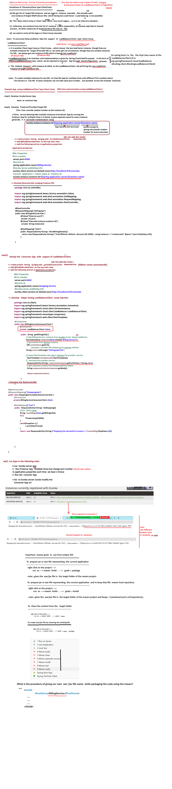

### **Load Balancer Client**

#### **What is a Load Balancer Client?**
A **Load Balancer Client** is a client-side component that distributes network traffic across multiple instances of a service to optimize resource utilization, maximize throughput, minimize latency, and ensure fault tolerance. In Spring Cloud, it's part of the client-side load balancing solution (e.g., Spring Cloud LoadBalancer) that selects an appropriate service instance from a list provided by a service discovery mechanism (e.g., Eureka).

#### **Why is it Used?**
- **Distribute Traffic**: Prevent overloading a single service instance.
- **Fault Tolerance**: Route requests away from unhealthy instances.
- **Scalability**: Seamlessly handle scaling up/down of service instances.
- **Latency Reduction**: Choose the closest or least busy instance.

---

### **How to Use a Load Balancer Client**
**Example with Spring Cloud LoadBalancer:**
1. **Add Dependencies** (in `pom.xml`):
   ```xml
   <dependency>
       <groupId>org.springframework.cloud</groupId>
       <artifactId>spring-cloud-starter-loadbalancer</artifactId>
   </dependency>
   <dependency>
       <groupId>org.springframework.cloud</groupId>
       <artifactId>spring-cloud-starter-netflix-eureka-client</artifactId>
   </dependency>
   ```

2. **Enable Load Balancing** in a `RestTemplate` or `WebClient`:
   ```java
   @Configuration
   public class AppConfig {
       @Bean
       @LoadBalanced // Enables client-side load balancing
       public RestTemplate restTemplate() {
           return new RestTemplate();
       }
   }
   ```

3. **Make Requests Using Service Names** (instead of hardcoding URLs):
   ```java
   String response = restTemplate.getForObject("http://PAYMENT-SERVICE/pay", String.class);
   ```

---

### **Key Differences: Discovery Client, Load Balancer, and Feign Client**

| Component                | Purpose                                                                 | How It Works                                                                 |
|--------------------------|-------------------------------------------------------------------------|-----------------------------------------------------------------------------|
| **Discovery Client**     | **Service Discovery**: Fetch instances from a registry (e.g., Eureka). | Queries the service registry to get a list of available service instances.  |
| **Load Balancer Client** | **Traffic Distribution**: Choose an instance from discovered services. | Uses algorithms (e.g., round-robin) to pick an instance for each request.   |
| **Feign Client**         | **Declarative REST Client**: Simplify HTTP requests with load balancing. | Integrates with Load Balancer to auto-resolve service names and distribute traffic. |

---

### **When to Use Each?**
1. **Discovery Client**:
   - Use when you need to manually fetch service instances (e.g., for custom logic).
   ```java
   @Autowired
   private DiscoveryClient discoveryClient;

   List<ServiceInstance> instances = discoveryClient.getInstances("PAYMENT-SERVICE");
   ```

2. **Load Balancer Client**:
   - Use with `RestTemplate` or `WebClient` for simple load-balanced requests.
   ```java
   // Uses @LoadBalanced RestTemplate
   String response = restTemplate.getForObject("http://PAYMENT-SERVICE/pay", String.class);
   ```

3. **Feign Client**:
   - Use for declarative, annotation-driven REST clients (no boilerplate code).
   ```java
   @FeignClient("PAYMENT-SERVICE")
   public interface PaymentClient {
       @GetMapping("/pay")
       String pay();
   }

   // Autowire and use directly:
   String response = paymentClient.pay();
   ```

---

### **Key Takeaways**
- **Discovery Client** = "Find all instances of Service X."
- **Load Balancer Client** = "Choose one instance of Service X to send this request."
- **Feign Client** = "Send a request to Service X (auto-resolve and load-balance)."