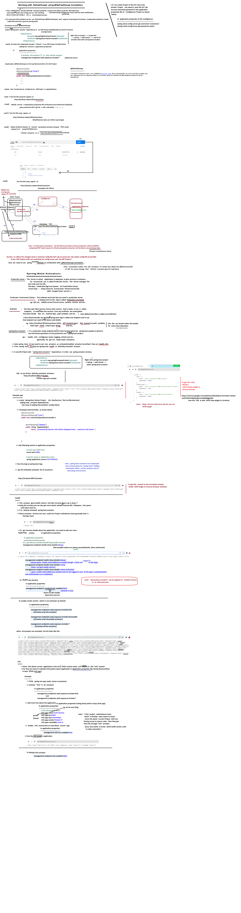

### Steps:

1. Start the **Proj02 Eureka Server**.
2. Start the **Proj12 Native Config Server**.
3. Start the **Proj14** and **Proj15 Services**.
4. Change the value in **application.properties**.
5. Send a **POST** request to `http://localhost:9091/actuator/refresh`.

In Spring Cloud, a **Native Config Server** refers to a configuration server that provides externalized configuration for applications. It allows Spring applications to retrieve configuration properties from external sources, such as files, databases, or a centralized configuration server, instead of being hardcoded within the application code or stored in a local `application.properties` or `application.yml` file.

The **Native Config Server** in Spring Cloud, particularly when used with Spring Cloud Config, enables the ability to:

1. **Centralize Configuration Management**: It serves as a centralized place for managing configuration properties across multiple microservices or applications. This is helpful when you have several services and want to manage configurations in one place.

2. **Environment-specific Configurations**: The config server supports storing different configurations for different environments (like `dev`, `test`, `prod`), so each environment can have its own configuration, without needing to modify the code of each microservice.

3. **Externalized Configuration**: With Spring Cloud Config Server, you can externalize configurations for different applications and services. This means you don't need to rebuild the application every time you need to change a property.

### Key Features of a Native Config Server:

- **Git, SVN, and File-based Repositories**: The Config Server can use various backends for storing configuration data, including Git repositories, SVN repositories, or even local file systems. These backends store properties in key-value pairs or YAML/JSON files.

- **Dynamic Configuration**: With Spring Cloud Config, you can dynamically update configurations without needing to restart your services. For instance, using `/actuator/refresh` endpoint, your services can reload the configuration changes in real-time.

- **Versioning and History**: If using a Git repository, you can take advantage of version control for configuration, allowing you to track changes and roll back to previous configurations when necessary.

### How it works:

1. **Config Server**: The server exposes an endpoint that provides the configuration for each application (service). It fetches the configuration from a repository, such as a Git repository, and serves it to the application.

2. **Client Application**: The client application (i.e., microservices) communicates with the Config Server to fetch its configuration properties. The configuration is automatically injected into the Spring application using Spring's `@Value` annotation or `@ConfigurationProperties`.

3. **Refresh Mechanism**: If the configuration changes while the service is running, the client can use an actuator endpoint (e.g., `/actuator/refresh`) to reload the configuration dynamically without restarting the service.

### Benefits:

- **Separation of Configuration and Code**: Keeps configuration outside of application code, making it easier to change without requiring code changes or redeployment.
- **Centralized Management**: Ideal for managing configuration in distributed systems and microservices.
- **Improved Flexibility**: Enables different configurations for different environments (development, staging, production).
- **Security**: Sensitive configuration properties, like database credentials, can be securely managed and versioned.
