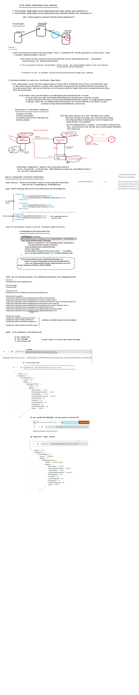

The **Circuit Breaker Design Pattern** is used to prevent a failure in one part of the system from cascading and affecting the entire application. When a service call fails repeatedly, the circuit breaker "trips," preventing further calls to the failing service and providing the system with a fallback mechanism.

In **Spring Boot**, this pattern can be implemented using **Resilience4j**, a lightweight fault tolerance library that provides several patterns, including the **circuit breaker**. Here's how you can implement it.

### Steps to Implement the Circuit Breaker Design Pattern Using Resilience4j in Spring Boot:

1. **Add Dependencies:**
   You need to include the Resilience4j dependency in your `pom.xml` (if using Maven) or `build.gradle` (if using Gradle) file.

   **Maven Dependency:**
   ```xml
   <dependency>
       <groupId>io.github.resilience4j</groupId>
       <artifactId>resilience4j-spring-boot2</artifactId>
       <version>1.7.0</version> <!-- Make sure to check for the latest version -->
   </dependency>
   ```

   **Gradle Dependency:**
   ```groovy
   implementation 'io.github.resilience4j:resilience4j-spring-boot2:1.7.0' // Check for the latest version
   ```

2. **Configure Circuit Breaker in `application.yml` or `application.properties`:**
   
   In your `application.yml` or `application.properties`, you can configure the properties of the circuit breaker.

   Example using `application.yml`:

   ```yaml
   resilience4j.circuitbreaker:
     instances:
       myServiceCircuitBreaker:
         registerHealthIndicator: true
         failureRateThreshold: 50   # If more than 50% of calls fail, it will trip the breaker
         waitDurationInOpenState: 10000ms  # Time for which the circuit will stay open before trying again
         ringBufferSizeInClosedState: 100  # Number of calls to collect before evaluating
         ringBufferSizeInHalfOpenState: 10  # Number of calls when in half-open state to determine success
   ```

   This configuration defines a circuit breaker for a service called `myServiceCircuitBreaker`.

3. **Annotate Service Methods with `@CircuitBreaker`:**
   Once the configuration is in place, you can annotate the methods that will be protected by the circuit breaker.

   Example:

   ```java
   import io.github.resilience4j.circuitbreaker.annotation.CircuitBreaker;
   import org.springframework.stereotype.Service;
   import org.springframework.web.client.RestTemplate;

   @Service
   public class MyService {

       private final RestTemplate restTemplate;

       public MyService(RestTemplate restTemplate) {
           this.restTemplate = restTemplate;
       }

       @CircuitBreaker(name = "myServiceCircuitBreaker", fallbackMethod = "fallbackMethod")
       public String callExternalService() {
           return restTemplate.getForObject("http://external-service/api", String.class);
       }

       // Fallback method to be called when the circuit breaker is open
       public String fallbackMethod(Exception ex) {
           return "Service is currently unavailable. Please try again later.";
       }
   }
   ```

   - The `@CircuitBreaker` annotation is applied to the method that you want to protect with a circuit breaker.
   - The `name` attribute corresponds to the circuit breaker instance defined in `application.yml`.
   - The `fallbackMethod` specifies the method to be called when the circuit breaker is open or a failure occurs.

4. **Create a RestTemplate Bean (Optional but recommended for making HTTP calls):**
   If you plan to make HTTP calls (as in the example above), you may need a `RestTemplate` bean.

   ```java
   import org.springframework.context.annotation.Bean;
   import org.springframework.context.annotation.Configuration;
   import org.springframework.web.client.RestTemplate;

   @Configuration
   public class AppConfig {

       @Bean
       public RestTemplate restTemplate() {
           return new RestTemplate();
       }
   }
   ```

5. **Monitor and Manage Circuit Breaker States:**
   Spring Boot automatically exposes metrics for the circuit breaker, which you can monitor. You can use **Spring Actuator** to check the status of your circuit breakers.

   Example:

   ```yaml
   management:
     endpoints:
       web:
         exposure:
           include: "circuitbreakers"
   ```

   This allows you to check the status of your circuit breakers via the `/actuator/circuitbreakers` endpoint.

6. **Handle Circuit Breaker States:**
   Resilience4j supports several states for the circuit breaker:
   - **Closed**: Circuit breaker is closed, and the requests are allowed to pass through.
   - **Open**: Circuit breaker is open, and the requests are not allowed to pass through.
   - **Half-Open**: The circuit breaker is in a half-open state, where some requests are allowed to pass through to check if the service has recovered.

   The **fallback** method gets executed when the circuit breaker is open or when an exception occurs.

### Summary of Key Annotations and Methods:
- **`@CircuitBreaker(name = "name", fallbackMethod = "method")`**: Used to annotate the method that you want to protect with the circuit breaker.
- **`fallbackMethod`**: The method that will be executed when the circuit breaker is open or when the decorated method fails.
  
### Example Scenario:
Imagine you have a service that makes an external HTTP request to a remote service. If that service becomes unavailable (e.g., due to network issues or server downtime), the circuit breaker will open after a certain number of failures, preventing further calls to the external service. Instead of hanging or crashing the application, you return a predefined response (fallback) like `"Service is currently unavailable"`. After a while, the circuit breaker will check if the external service is available again (half-open state).

### Benefits of Using Circuit Breaker with Resilience4j:
- **Improved Fault Tolerance**: The circuit breaker helps to isolate failures and prevents them from affecting other parts of the system.
- **Fallback Mechanism**: Provides an alternative response if a service call fails.
- **Resilience and Recovery**: Helps in managing failures in distributed systems by providing a mechanism to recover and continue the system's operation.
  
This approach improves system stability, resilience, and user experience by gracefully handling failures and preventing cascading problems.