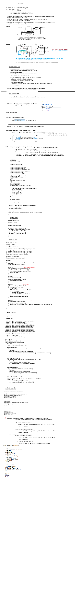

### What is Redis Cache?

**Redis** (Remote Dictionary Server) is an open-source, in-memory data store that is used as a **cache** and a **message broker**. It supports various data structures such as strings, lists, sets, hashes, and more, which makes it highly versatile and fast. **Redis cache** is specifically used to store and manage data in memory to speed up data retrieval operations.

In simple terms, Redis Cache is a way to temporarily store frequently accessed data in memory, significantly improving the speed of applications by reducing the need to repeatedly access slower databases, file systems, or APIs.

### Key Concepts of Redis Cache

1. **In-memory storage**: 
   - Redis is an **in-memory data store**, meaning it stores data in RAM rather than on disk. This results in very fast read and write operations compared to disk-based storage like traditional relational databases.
   - Because Redis stores data in memory, it is ideal for caching frequently accessed data that can be quickly retrieved.

2. **Persistence Options**:
   - Although Redis is primarily an in-memory store, it provides persistence mechanisms, such as **RDB (Redis Database)** snapshots and **AOF (Append-Only File)** logs, to ensure data isn't lost in case of failure or restart. However, Redis can still be used purely as a cache with no persistence (data will be lost if Redis restarts).

3. **Data Structures**:
   Redis supports various complex data types like:
   - **Strings** (e.g., key-value pairs like `product_name: "iPhone 13"`)
   - **Lists** (ordered collection of elements, useful for queues)
   - **Sets** (unordered collection of unique elements, ideal for preventing duplicates)
   - **Hashes** (a collection of key-value pairs, useful for storing structured data like objects)
   - **Sorted Sets** (similar to sets but with an associated score, used for ranking items)
   - **Bitmaps, HyperLogLogs, Geospatial indexes** for advanced use cases.

### How Does Redis Cache Work?

The main idea behind using Redis for caching is to store data in memory (RAM) so it can be quickly retrieved. Here's how Redis works as a cache:

1. **Caching Layer**:
   - **Cache Miss**: When a request is made to the application, it first checks whether the data exists in the Redis cache.
   - **Cache Hit**: If the data exists in Redis, the system retrieves it from the cache, avoiding the need to access the slower data store (like a database).
   - **Cache Miss Handling**: If the data is not found in the cache (cache miss), the application fetches the data from the primary data source (e.g., a database) and stores it in the Redis cache for future access.

2. **Expiration**:
   - Redis allows setting **TTL (Time To Live)** on cached data, which means the data expires automatically after a defined period. This ensures that the cache is refreshed periodically and doesn't hold stale data.

3. **Eviction Policies**:
   - When Redis runs out of memory, it evicts keys based on predefined policies. Some common eviction policies include:
     - **LRU (Least Recently Used)**: Evicts the least recently accessed data.
     - **LFU (Least Frequently Used)**: Evicts the least frequently accessed data.
     - **TTL expiration**: Evicts keys that have expired.

4. **Write-Through Caching**:
   - In some caching setups, a write-through strategy is used where every time data is written to the database, it's also written to the Redis cache. This ensures that the cache is always in sync with the database.

5. **Cache Invalidation**:
   - Cache invalidation refers to removing outdated data from the cache. This can be done manually (via application code or Redis commands) or automatically through TTL expiration. It's crucial to ensure that the cache doesn't hold outdated data, especially in high-traffic applications.

### Advantages of Using Redis Cache

1. **Speed**:
   - Redis is extremely fast because it stores all data in memory (RAM). Accessing data in memory is orders of magnitude faster than querying a disk-based database.

2. **Scalability**:
   - Redis supports **horizontal scaling** by partitioning data across multiple nodes (Redis clusters). It also supports replication, where data can be copied to multiple Redis servers for fault tolerance.

3. **Reduced Load on Databases**:
   - By caching frequently accessed data, Redis reduces the load on primary data stores (such as relational databases), which improves overall application performance and reduces database costs.

4. **High Availability**:
   - Redis provides high availability through **replication** and **sentinel** features. Redis Sentinel monitors Redis servers and automatically promotes a replica if the primary node goes down.

5. **Flexible Data Structures**:
   - Redis supports multiple data structures such as strings, lists, sets, and hashes, allowing developers to store and manage complex data in cache efficiently.

6. **Support for Pub/Sub Messaging**:
   - Redis supports publish/subscribe messaging patterns, making it useful for messaging and real-time applications, in addition to caching.

7. **Persistence Options**:
   - Redis can offer persistence mechanisms to back up data if necessary, while still primarily acting as a cache.

### Common Use Cases for Redis Cache

1. **Session Store**:
   - Redis is commonly used to store user session data. Since Redis supports fast read/write operations and can handle TTL (time-to-live) settings, it's perfect for session management.

2. **Caching Database Queries**:
   - If certain database queries or API calls are frequently accessed, Redis can cache the result of these queries, reducing database load and improving performance.

3. **Leaderboard/Ranking Systems**:
   - Redis’ sorted sets are ideal for leaderboard implementations, where you need to maintain ranked lists of players or other entities in real-time.

4. **Counting and Rate Limiting**:
   - Redis is often used for counting events, tracking requests, or implementing rate-limiting mechanisms (e.g., limiting API calls to prevent abuse).

5. **Message Queue**:
   - Redis supports a publish/subscribe model and lists, which can be used as an efficient message queue for decoupling components in a distributed system.

### Redis Cache Commands (Examples)

Here are some basic commands to interact with Redis as a cache:

- **Set a Key-Value Pair**:
  ```bash
  set key value
  ```

- **Get a Value by Key**:
  ```bash
  get key
  ```

- **Set a Key with Expiration (TTL)**:
  ```bash
  setex key seconds value
  ```

- **Check if a Key Exists**:
  ```bash
  exists key
  ```

- **Delete a Key**:
  ```bash
  del key
  ```

- **List Operations (e.g., Add to a List)**:
  ```bash
  lpush mylist value
  ```

- **Get All Items in a List**:
  ```bash
  lrange mylist 0 -1
  ```

- **Set Cache Expiration**:
  ```bash
  expire key seconds
  ```

### Redis Cache in Spring (Example)

In a Spring Boot application, you can enable Redis caching by including the following in your `application.properties`:

```properties
spring.cache.type=redis
spring.redis.host=localhost
spring.redis.port=6379
```

Then, in your service, you can use Spring's caching annotations:

```java
@Service
public class ProductService {

    @Cacheable(value = "products", key = "#productId")
    public Product getProductById(int productId) {
        // Perform database query here if not cached
    }

    @CacheEvict(value = "products", key = "#productId")
    public void deleteProduct(int productId) {
        // Perform delete action here
    }

    @CachePut(value = "products", key = "#product.id")
    public Product saveProduct(Product product) {
        // Save the product and update cache
    }
}
```